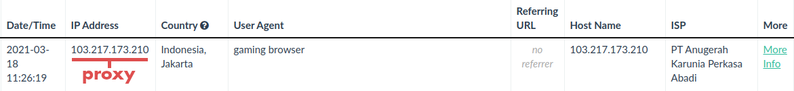

# Check link
Safely investigates a link and takes screenshots of everything it finds. Good for checking shady links.

---

## What it finds

### The root of the URL


It will follow where the root of the URL takes it. It ended up at
`https://grabify.link` in this example, and this is the screenshot it took:


### The redirect
It will follow where the main link takes it. It ended up at
`https://google.com` in this example, and this is the screenshot it took:


---

## Peace of mind
All requests are run through an anonymous proxy so your IP address is safe.

```python
# Get proxy
collector = proxyscrape.create_collector("main", "https")
proxy = collector.get_proxy({
    "type": "https",
    "anonymous": True
})

# Initialize pyppeteer
browser = await pyppeteer.launch(
    ignoreHTTPSErrors=True,
    args=[f"--proxy-server={proxy.host}:{proxy.port}"])
```

This is all an attacker would see:

